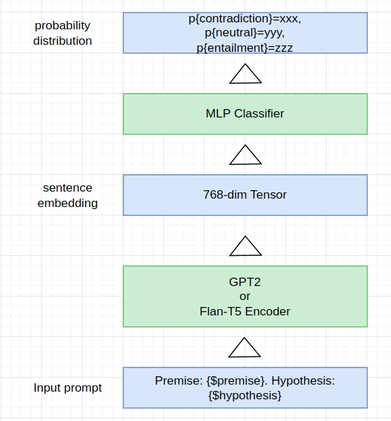
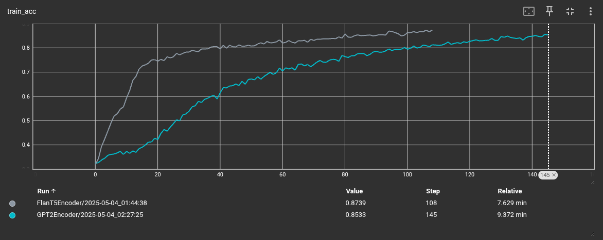
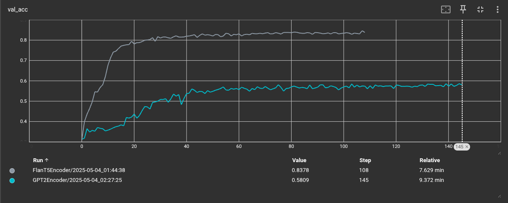
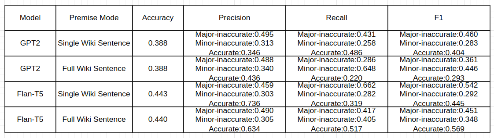

# Report  

This is part of my course project and is not intended for research use.  

## 2.1 Applying LMs for NLI: Method  

### Base Model and Adaptation
My method is based on **finetuning**.   

I use the base version of **GPT2** and **Flan-T5** as base model. The two base models are adapted and used as sentence encoder, which encode a sentence into a fixed-dimensional vector (specifically, 768 dimensions). 
For **Flan-T5**, we only use the encoder part.   

For **GPT2**, the last word embedding is used as sentence embedding because **GPT2** is not a bi-directional model. For **Flan-T5**, the summation of all valid word embedding is used as sentence embedding.  

The sentence embedding will then feed to a MLP to do 3-class (contradiction, neutral, entailment) classification.  

### Input Prompting  

The premise and hypothesis will be combined by a very simple prompt format: `f"Premise: {premise}. Hypothesis: {hypothesis}"`.  

### Finetuning and Result  

70% of samples in MultiNLI dataset are used as training samples.  

The MLP classifier and the sentence encoder are jointly trained (finetuned). For sentence encoder, I freeze all layer parameters in the transformer except for the last layer.  

Both **GPT2** and **Flan-T5** can be stably finetuned, but **GPT2** encoder suffers from severe overfitting, resulting in a high accuracy on training set but low bad performance on validation set.    

Finetuned **Flan-T5** achieved around 83% accuracy on validation set, while **GPT2** only get about 58%.  

  

## 2.2 NLI for hallucination detection: Method  

### Models  

I directly use the tuned models (**GPT2** and **Flan-T5**) mentioned in **2.1**. No extra finetuning on **GPT3HallucinationDataset**.  

### Prompting  

I follow the prompting format in **2.1**. The format is simply `f"Premise: {premise}. Hypothesis: {hypothesis}"`, where premise comes from wiki_text and hypothesis comes from GPT3-generated text.  

I tried 2 ways of prompting.   
One is to use the full wiki_text (contains mutiple sentences) as premise, and a single GPT3-generated sentence as hypothesis, then output whether the GPT3 sentence is a hallucination.   
Another is to use single wiki sentence as premise, and single GPT3-generated sentence as hypothesis, and   
* If one of the wiki sentence response to GPT3-generated sentence as "contradiction", then the GPT3 sentence is a hallucination.
* If one of the wiki sentence response "entailment", the the GPT3 sentence is accurate
* Otherwise the GPT3 sentence is minor-inaccurate.  

Both way gives similar accuracy.  

### Result  

Unfortunatly the performance is a disaster  

  

